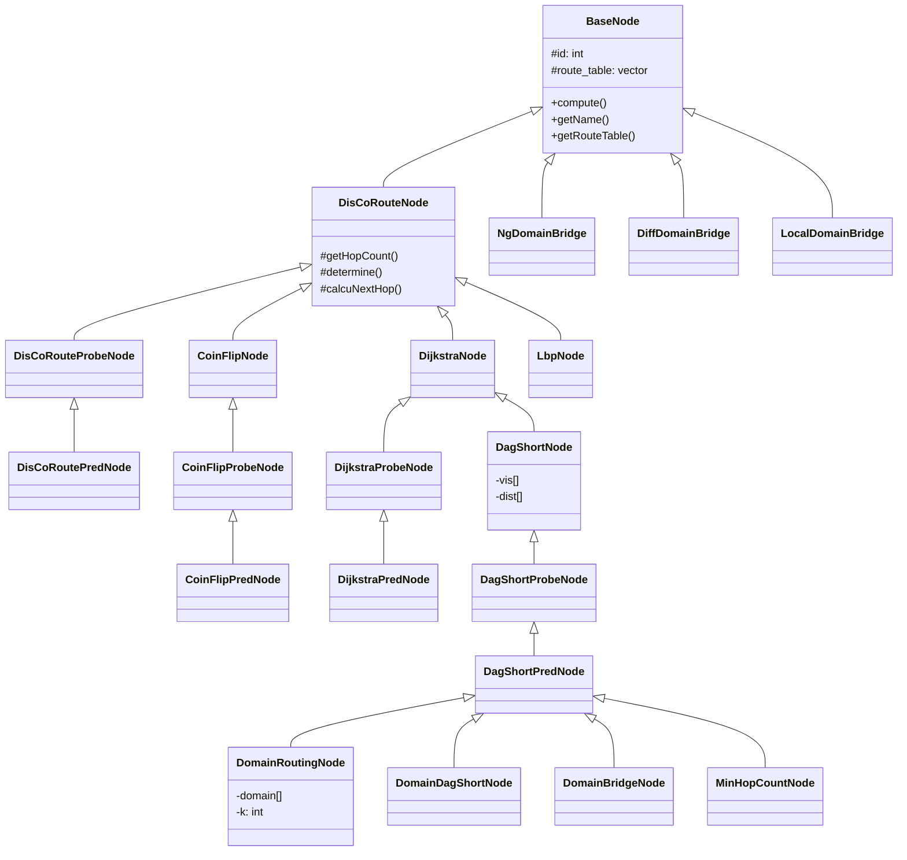
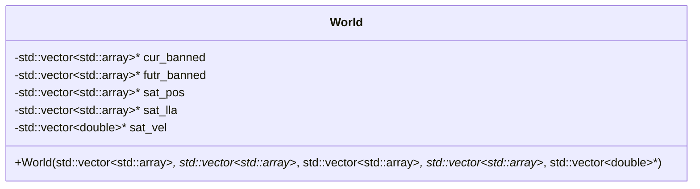
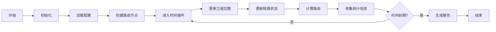

### 背景
1. 代码位置: http://192.168.1.250/chenyxuan/satnet
2. 基于 C++ 的星间链路仿真器，用于模拟卫星星座中的卫星之间的通信。

### 代码结构

#### 代码文件组成
├── lib/                    # 核心路由算法
│   ├── base.hpp           # 基础路由节点类
│   ├── dagshort.hpp       # 基于DAG（有向无环图）的最短路径路由
│   ├── dijkstra.hpp       # Dijkstra算法路由
│   ├── discoroute.hpp     # DisCoRoute算法
│   ├── domain.hpp         # 基于域的路由
│   ├── minhopcount.hpp    # 最小跳数路由
│   ├── ngdomain.hpp       # 下一代域路由
│   ├── space.hpp          # 主要的模拟框架
│   └── utils.h           # 实用函数
├── main.cpp               # 程序入口点
├── configs/               # 配置文件
├── visualization/         # 可视化组件
└── docs/                 # 文档

domain route

轨道面编号:   0   1 | 2   3 | 4   5 | 6   7
卫星编号:     0   4 | 8   12| 16  20| 24  28
             1   5 | 9   13| 17  21| 25  29
             2   6 | 10  14| 18  22| 26  30
             3   7 | 11  15| 19  23| 27  31

域划分:      域0    |  域1   |  域2   |  域3

### 功能模块

核心模块
1. 基础路由 (BaseNode)
    * 所有路由算法的基础类
    * 提供通用接口和工具
    * 接口:
        * `compute()`: 计算路由表
        * `getRouteTable()`: 访问路由结果
        * `getName()`: 获取算法名称
        * `move()`: 计算卫星移动
2. 路由算法
    多个继承自 `BaseNode` 的路由实现:
    * `DisCoRouteNode`
    * `DijkstraNode`
    * `DagShortNode`
    * `DomainRoutingNode`
    * `NgDomainBridge`
3. 仿真引擎 (SpaceSimulation)
    * 管理仿真生命周期
    * 处理:
        * 卫星位置和移动
        * 链路状态
        * 路由表更新
        * 统计数据收集
        * 输出生成
4. 全局配置类

### 函数整体逻辑

### 核心算法逻辑

1. 离散化，通过 hop 和 distance（delay） 两个指标进行选路
2. 模拟，圆环操作

### 评价指标计算
1. latency observer数组，关注特定卫星对之间的延迟和故障率
2. 

### 如何修改
1. 修改路由算法
    * 继承 `BaseNode` 类
    * 实现 `compute()` 方法
    * 在 `main.cpp` 中注册新的路由算法